# Google Summer of Code 2022 Final report

## Title - Music Blocks V3 Maintenance

### Organization - Sugarlabs

This is a elucidation of my work on
[V3 Maintenance](https://summerofcode.withgoogle.com/programs/2022/projects/oiE2yRSV)
during *Google Summer of Code 2022* with
[Sugar Labs](https://github.com/sugarlabs/). This repository contains
[links](./authored-files/), samples of my work, and
examples.The code samples for changes related to improvements and bug fixes are present in [authored files](./authored).
 

## 📙 Abstract

[*Music Blocks*](https://musicblocks.sugarlabs.org/) is a Visual 
Programming Language and collection of manipulative tools for exploring
musical and mathematical concepts in an integrative and fun way.

The purpose of my project is to maintain and fix

<ul>
<li><b>Loading</b> of requirements {Primary}
  <ol>
  <li>Avoid race conditions</li>
  <li>Ensure Android Version is reasonably robust</li>
  <li>To ensure better and reliable loading experience in both chrome and firefox.</li>
  <li>Research on how to manage loading requirements for large projects</li>
  </ol></li>
<li><b>Planet’s</b> cross origin errors</li> 
<li><b>Regression</b> in music utils code</li> 
<li><b>Better characterization</b> of code</li> 
<li><b>Other bugs</b> in v3 which can be resolved</li>  
<li><b>Documentation</b> Maintenance</li></ul> 

## 📝 Tech Stack

I've used my intensive experience with **HTML5, CSS and JavaScript** to fix and improve many features of version-3 since these are the primary languages used to build musicblocks V3.

[**`HTML5`**](https://en.wikipedia.org/wiki/HTML5) includes detailed processing models to encourage more interoperable implementations; it extends, improves, and rationalizes the markup available for documents and introduces markup and application programming interfaces (APIs) for complex web applications.

[**`CSS`**](https://en.wikipedia.org/wiki/CSS/) is designed to enable the separation of presentation and content, including layout, colors, and fonts. This separation can improve content accessibility; provide more flexibility and control in the specification of presentation characteristics; enable multiple web pages to share formatting by specifying the relevant CSS in a separate .css file, which reduces complexity and repetition in the structural content; and enable the .css file to be cached to improve the page load speed between the pages that share the file and its formatting.

[**`JavaScript`**](https://en.wikipedia.org/wiki/JavaScript) is a high-level, often just-in-time compiled language that conforms to the ECMAScript standard. It has dynamic typing, prototype-based object-orientation, and first-class functions. It is multi-paradigm, supporting event-driven, functional, and imperative programming styles. It has application programming interfaces (APIs) for working with text, dates, regular expressions, standard data structures, and the Document Object Model (DOM).

In addition, for maintaining the `performance` of the application, many latest tools are used that help in website's optimizations by providing insights on various metrics and suggest opportunities to improve by 
diagnosing performance issues:-

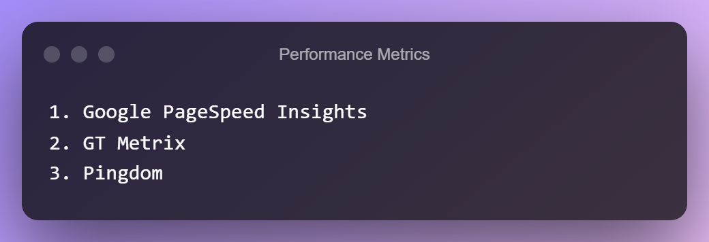

In the beginning, I explored many web application performance metrics website to check **loading reliability** and performance:-

<table>
     <th> 
       Performance and availability monitoring 
    </th>
    <tr> 
        <td><a href="https://pagespeed.web.dev/" target="_top">Pagespeed Insights (Google)</a></td>
    </tr>
    <tr> 
        <td><a href="https://gtmetrix.com/" target="_top">GT Metrix (Carbon 60)</a></td>
    </tr>
    <tr> 
        <td><a href="https://www.pingdom.com/" target="_top">Pingdom (SolarWinds)</a></td>
    </tr>
    
</table>

Finally, I decided to go with **PageSpeed Insights**. I have chosen this platform because it can evaluate all sorts of factors, including performance, accessibility, progressive web apps, and more. Apart from that, PageSpeed Insights (PSI) reports on the performance of a page on both mobile and desktop devices, and provides suggestions on how that page may be improved. PSI provides both lab and field data about a page. Lab data is useful for debugging performance issues, as it is collected in a controlled environment . 

Also, I have used **FFmpeg** to convert GIF to .mp4 and .webm to improve loading speed and reliability.

[**`FFmpeg`**](https://ffmpeg.org/) is the leading multimedia framework, able to decode, encode, transcode, mux, demux, stream, filter and play pretty much anything that humans and machines have created. It supports the most obscure ancient formats up to the cutting edge. No matter if they were designed by some standards committee, the community or a corporation. It is also highly portable: FFmpeg compiles, runs, and passes our testing infrastructure FATE across Linux, Mac OS X, Microsoft Windows, the BSDs, Solaris, etc. under a wide variety of build environments, machine architectures, and configurations.

 

## ✨ Work Progression

In the community bonding period, the work was mostly confined to coming up with an updated time-line with the detailed list of tasks and their potential solutions. In this period there were a lot of meetings and discussions with mentors on video and text based platforms and through extensive communication a timeline was drawn that was in the best interest of the project. 
This period was also used for introductions and getting to know fellow contributors and also getting used to and familiar with the organization’s work culture and best practices.

**Key-events during Community Bonding Period**

<ul>
    <li>
    Creation of updated timeline - exhaustive list of objectives, a narrative of the features to build, 
    and a list of implementation detail segmented in 12 equal parts
        <ul>
            <li>
            <a href=https://docs.google.com/document/d/1O-M2beXdoQVMs1HpkLHPCtkveAkN-jCB6p_2EI7GTkg/edit#>Gsoc Timeline</a>
            </li>
        </ul>
    
</li>
    
<li>
    Getting to know the <a href=https://github.com/sugarlabs/musicblocks>codebase</a> of music blocks
    </li>

<li>
    Communication with mentors regarding the details of the project
    </li>
</ul>

My work, basically, consisted of four major parts:
<ol>
    <li>  
        Loading speed and reliability of web application
    </li>
    <li> 
        Resolving Cross Origin Problems
    </li>
    <li>
         Regression in music utils code
    </li>
    <li>
        Documentation Maintenance 
    </li>
</ol>

`Since, major part of the code cannot be changed as version-4 is in the making for better characterization and modularity, so the maintenance is majorly focused on small changes that can leave maximum impact on performance of the application.`

## 📝 Loading of Requirements

Musicblocks v3 is a large project with a lot of modules and functionality, and hence it is very important to follow the best practices when managing it's loading requirements.
Initially, the speed and relaibility of v3 requirements loading was very slow on both chrome and firefox.

The report by [PageSpeed Insights](https://pagespeed.web.dev/) :- 

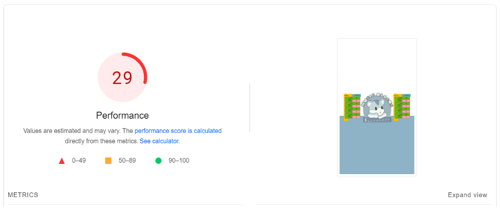
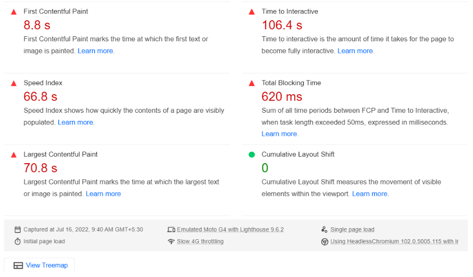
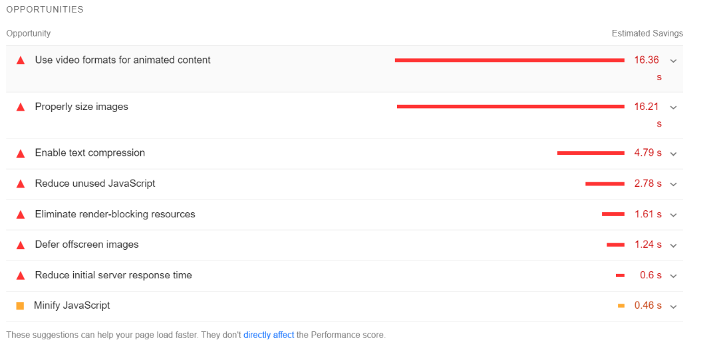

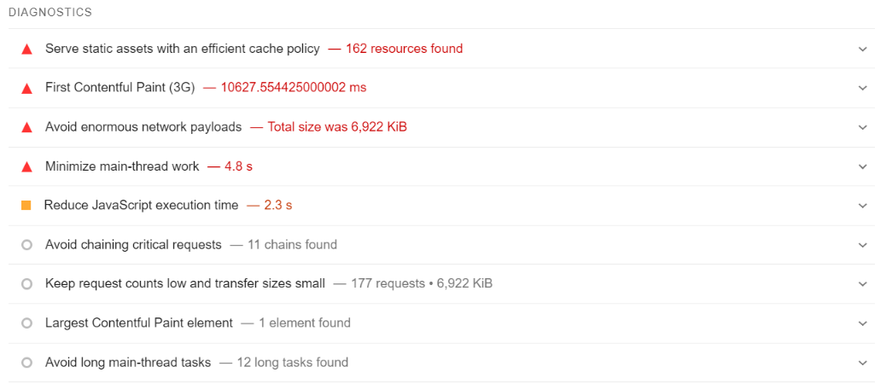

Overall Performance Score :- **29/100**

**Resolution :-**

<ol>
    <li><b> Deleted -- /loading-animation.gif size- 3.44mb (3612912 kb) -> Added -- /loading-animation.mp4 size - less than 260kb</b>

Estimated Savings - **2.66 seconds**

Animated GIFs have three key traits that a video needs to replicate:

<ul>
    <li>They play automatically.</li>
    <li>They loop continuously (usually, but it is possible to prevent looping).</li>
    <li>They're silent.</li>
</ul>
Using video tag and it's attributes recreated these behaviors.

Details on how to convert artwork[GIF] to video is elaborated [here](https://github.com/sugarlabs/musicblocks/blob/master/video.md).

This step solves many problems of loading issue:-
<ul>
    <li>Use video formats for animated content with proper sizing. (Savings - 2.66s )</li>
    <li>Largest contentful paint. (40s to less than 2s, savings - more than 30s)</li>
    <li>Makes the android version robust.</li>
</ul>
    </li>
    <li><b>Changing img to amp-img</b>

AMP may choose to delay or prioritize resource loading based on the viewport position, system resources, connection bandwidth, or other factors. The amp-img components allows the runtime to effectively manage image resources this way.

Potential savings :-
Memory = **276.5kb + 18.3kb**
Time = **0.2s**
    </li>
</ol>

`Eliminate render blocking resources was also a potential method to save more load time however these changes make the index.html file very unreadable and have a little or no affect on loading reliability of requirements and thus making a script inline is not a very efficient solution to the problem at hand , henceforth will be discontinued .`
[Learn More](https://github.com/sugarlabs/musicblocks/pull/3040).

After implementation:- 

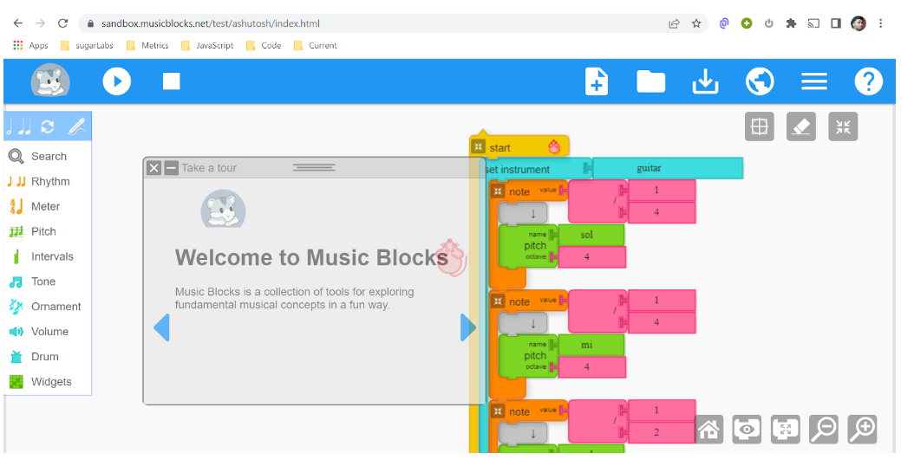
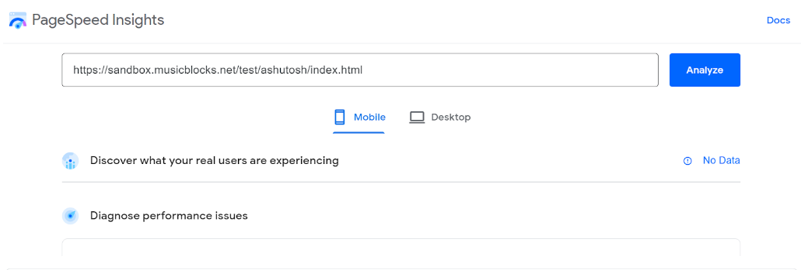
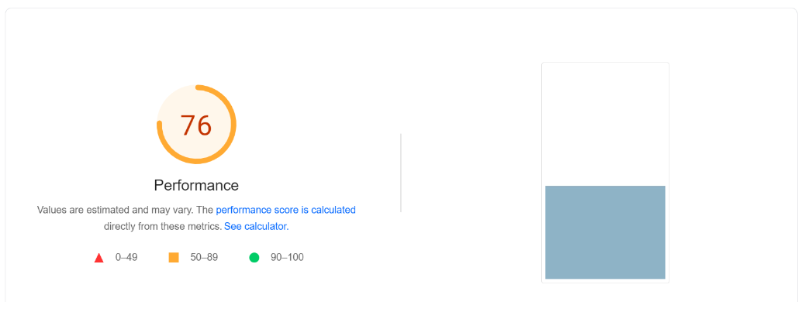
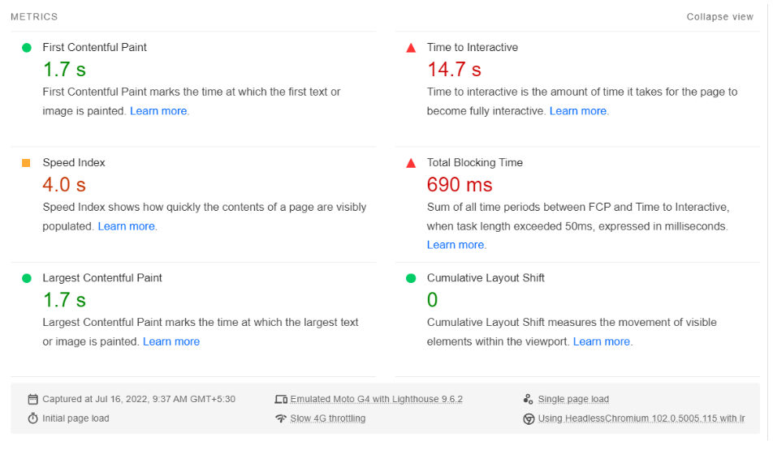
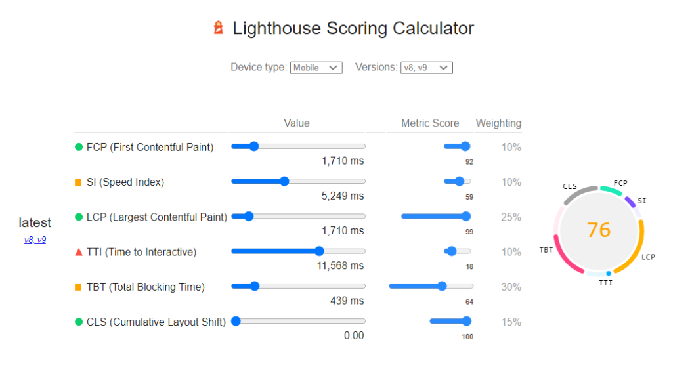

Overall Performance Score :- **76/100**

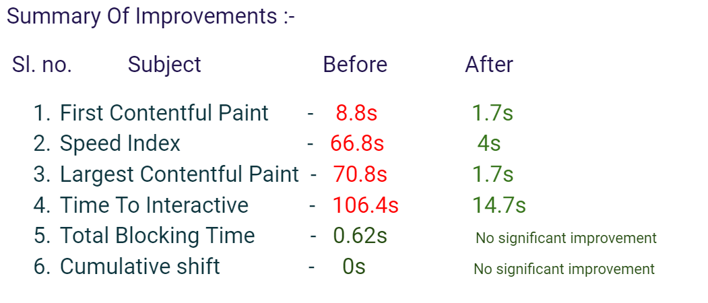

**Loading reliability** and speed is increased from **29/100** to **76/100** . Improvement of more than **162%** .

`This issue addresses the barebones and major sections by which loading reliability is very low`:

<table>
    <tr>
        <td> 🐛 Issue </td> 
        <td> #3035 #3039 #3042 #3045 #3046 #3047 #3048 </td>
        <td> <a href="https://github.com/sugarlabs/musicblocks/issues/3035" target="_top">Loading Of Requirements</a></td>
    </tr>
    <tr>
        <td> 🔀 PR </td> 
        <td> #3043 #3048 </td>
        <td> <a href="https://github.com/sugarlabs/musicblocks-v4/pull/71" target="_top">Loading Of Requirements PR</a></td>
    </tr>
    <tr>
        <td> 🎉 Commits </td> 
        <td> 6 </td>
        <td> <a href="https://github.com/sugarlabs/musicblocks/pull/3038/commits" target="_top"> all-commits</a></td>
    </tr>
</table>

`There were total of six commits .`

## 📝 Cross Origin Errors

**Before:-**
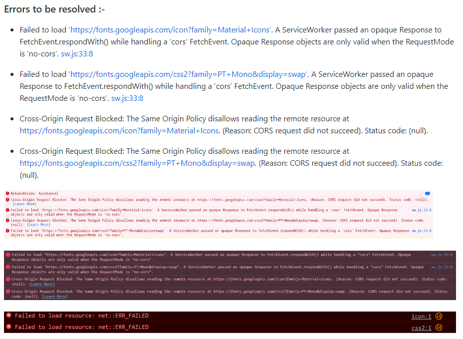

**Solution:-**

Cross origin is arising due to the fonts that are being accessed from google API , removing that section of code resolves this issue.

**After:-**
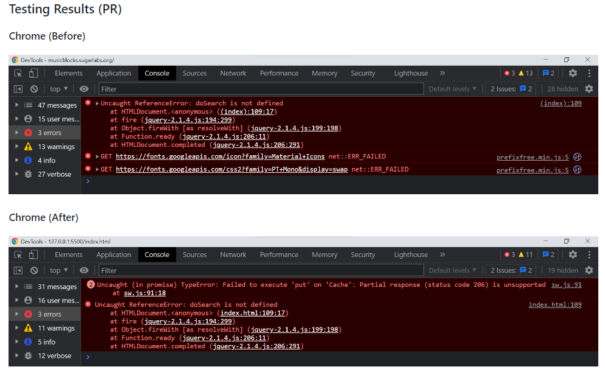

<table>
    <tr>
        <td> 🐛 Issue </td> 
        <td> #3049 </td>
        <td> <a href="https://github.com/sugarlabs/musicblocks/issues/3049" target="_top">Cross origin errors </a></td>
    </tr>
    <tr>
        <td> 🔀 PR </td> 
        <td> #3050 </td>
        <td> <a href="https://github.com/sugarlabs/musicblocks/pull/3050" target="_top">Mcross origin errors removed</a></td>
    </tr>
    <tr>
        <td> 🎉 Commits </td> 
        <td> 1 </td>
        <td> <a href="https://github.com/sugarlabs/musicblocks-v4/pull/3050/files" target="_top"> all-commits</a></td>
    </tr>
</table>

## 📝 Regression in music utils 

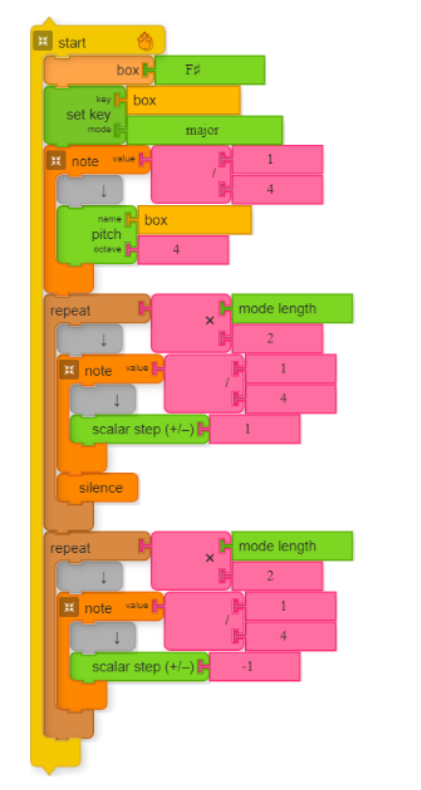
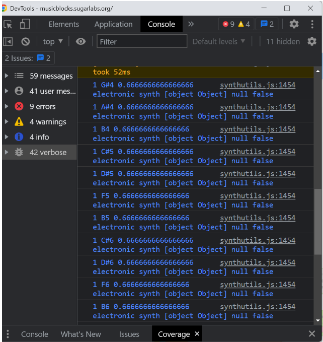
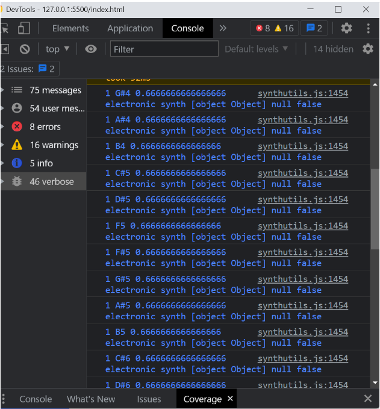

<table>
    <tr>
        <td> 🐛 Issue </td> 
        <td> #78 </td>
        <td> <a href="https://github.com/sugarlabs/musicblocks-v4/issues/78" target="_top">Artboard Manager Framework </a></td>
    </tr>
    <tr>
        <td> 🔀 PR </td> 
        <td> #80 </td>
        <td> <a href="https://github.com/sugarlabs/musicblocks-v4/pull/80" target="_top">Manager PR</a></td>
    </tr>
    <tr>
        <td> 🎉 Commits </td> 
        <td> 14 </td>
        <td> <a href="https://github.com/sugarlabs/musicblocks-v4/pull/80" target="_top"> all-commits</a></td>
    </tr>
</table>

There were total fourteen commits consisting of adding type definitions for artboards and its props, modifying sketches for turtle and artboard to recieve signal from manager, testing the artboard, refactoring, adding more variables to the model component of manager, etc. 

## 📝 Documentation Maintenance

This can be divided into *two* sub parts. The *first* part is to integrate manager with other artboard components and *second* is to integrate it with monitor which will connect it with other components.
It was required that *the manager component* should also maintain a list of all the *turtles* with their own unique *id*, this list should match the ArtBoard list. 

For example, any insertion/deletion of any artboard in the list should also reflect in the turtle list.
This turtle list should be passed as a `prop` to `ArtBoardTurtle.tsx.` All the `n` turtles will be on the topmost canvas on a single canvas. Therefore to create n canvases we will require n artBoardSketch and 1 ArtBoardTurtle. These things are maintained by the *manager component*.
<table>
    <tr>
        <td> 🐛 Issue </td> 
        <td> #69 </td>
        <td> <a href="https://github.com/sugarlabs/musicblocks-v4/issues/69" target="_top">Manager and Monitor </a></td>
    </tr>
    <tr>
        <td> 🐛 Issue </td> 
        <td> #83 </td>
        <td> <a href="https://github.com/sugarlabs/musicblocks-v4/issues/83" target="_top"> Manager and Artboard Props</a></td>
    </tr>
    <tr>
        <td> 🔀 PR </td> 
        <td> #87 </td>
        <td> <a href="https://github.com/sugarlabs/musicblocks-v4/pull/87" target="_top">Artboard Manager and Monitor</a></td>
    </tr>
    <tr>
        <td> 🎉 Commits </td> 
        <td> 8 </td>
        <td> <a href="https://github.com/sugarlabs/musicblocks-v4/pull/87/commits" target="_top"> manager-monitor-commits</a></td>
    </tr>
</table>

There were a total of *eight* commits which include adding types and definitons for manager class in monitor, adding methods to `create`, `remove`, `update` artboards, etc.

## 🚀 Other bugs and fixes

The last week was reserved for testing but I used to test my code after frequently before making any PR. Also, for a side note, I used to take notes, document every point during the daily meetups. These things really helped me in writing this report. Every file has a README.md file which contains all the documentation.

<table>
    <tr>
        <td> 🔀 PR </td> 
        <td> #89 </td>
        <td> <a href="https://github.com/sugarlabs/musicblocks-v4/pull/89" target="_top">Documenation for artboards</a></td>
    </tr>
</table>

### ✨ Enhancements

There are many enhancements that can be done particularly to artboards. Currently we heavily use props and it renders frequently which affects the performance of the application. We can use **context hook**,**Hot module**, etc
to improve the performance. We can add features to save artworks in `png`, `svg` format.Just like `p5 wrapper` we can also put the code for art board in a separate utility. Check [here](https://github.com/Gherciu/react-p5/tree/main/src) for more details.

### 👨 Acknowledgements

On a final note, I am extremely grateful to my mentors, [Walter Bender](https://web.media.mit.edu/~walter/), [Devin Ulibarri](https://github.com/pikurasa) and [Anindya Kundu](https://github.com/meganindya).I am also very thankful for their motivation which helped me in improving the quality of my code and helping me improve my soft skills.

Thanks to [Google](https://www.google.com/), [GSoc](https://summerofcode.withgoogle.com/) ,[Sugarlabs](https://www.sugarlabs.org/) and [MusicBlocks](https://musicblocks.sugarlabs.org/) for this great opportunity.

Thanks

Ashutosh Gautam

